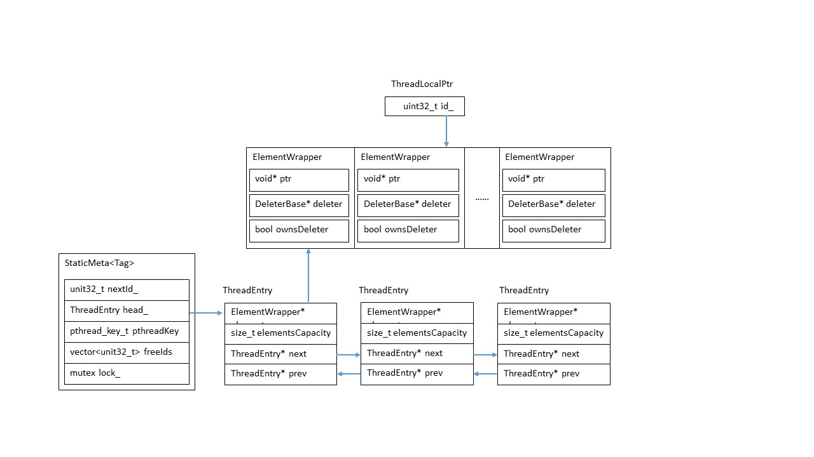

## Folly源码分析系列(一) — ThreadLocalPtr ##

Folly（ Facebook Open Source Library）是Facebook在2012年开源的C++11组件库。它以实用性和高效性为设计中心，提供了类似*boost*和*stl*的功能，包括`bitset`，散列，字符串等。

`ThreadLocalPtr`作为Folly库内置的一种智能指针，提供了与`boost::thread_specific_ptr`相似的功能：访问线程TLS(*Thread Local Storage*)数据的接口。通过`ThreadLocalPtr`变量可以在每个线程TLS中存储一份彼此互相隔离的自定义数据。用户可以通过`get()`接口获取当前线程的数据，也可以通过`accessAllThreads()`接口，遍历一个`ThreadLocalPtr`变量的所有线程的TLS数据。

### 1、ThreadLocalPtr API ###

`ThreadLocalPtr`是一个pointer，该pointer在不同的Thread中访问不同的数据。它提供了下面的api。

- *Default Constructor*：构造一个空的`ThreadLocalPtr`对象，不指向任何对象；
- *Move constructor*：移动构造函数；
- *Destructor*：销毁所有Thread中`this`指向的对象，并回收索引；
- *Move assignment operator*：首先销毁所有Thread中`this`指向的对象，并回收索引；然后使得`this`指向参数`other`的数据，`other`不再指向任何数据；
- *reset*：销毁`this`在当前线程中的TLS数据，并指向新的数据；
- *get*：返回`this`指向的TLS数据；
- *release*：返回`this`指向的TLS数据，同时使得`this`不再指向该数据；
- *operator->*：返回一个指向TLS数据的普通指针；
- *operator\**：直接返回普通数据；
- *operator bool()*：通过`ThreadLocalPtr`到`bool`的类型转换；

**需要说明的是**：通过禁用 *copy constructor* 和 *copy assignment `operator=()`*，使得`ThreadLocalPtr`成为*non-copyable*的，使得没有两个`ThreadLocalPtr`指向同一个TLS数据。

### 2、设计实现 ###

程序维护一个TLS的指针数组，每个指针指向一个对象。`ThreadLocalPtr`保存一个指向指针数组的索引。它们的关系如下图所示：

#### (1) `ThreadLocalPtr`类 ####
表示一个TLS pointer，有一个*private*的数据成员`id_`保存索引。可以通过该索引访问`ThreadEntry::elements`数组的第`id_`个数据。

#### (2) `StaticMeta<Tag>`类 ####
`StaticMeta<Tag>`一个用*class template*实现的 *sigleton* 。对于每个类型，`StaticMeta<Tag>`类模板会创建出不同的类。例如：`StaticMeta<String>`，表示一个模板类型为`String`的`StaticMeta` *singleton*实例。
`StaticMeta<Tag>`主要提供三个方面的功能：

- 初始化`ThreadLocalPtr`的`id_`值

这个`id_`值是通过`StaticMeta<Tag>`成员函数`static uint32_t create()`返回。`StaticMeta<Tag>`维护一个`unit32_t`类型的数据`nextId_`，表示下一个可用的索引；同时维护一个`vector<unit32_t>`的`freeIds_`，保存已经被销毁的`ThreadLocalPtr`的索引。如果`freeIds_`不为空，那么`create()`将返回`freeIds_`中的最后一个索引；否则，返回`nextId_`，并把`nextId_`加一。

**注意**：`create()`通过`StaticMeta<Tag>::lock_`来保证对`nextId_`和`freeIds_`的访问是线程安全的。

- 提供访问当前Thread的TLS数据的接口

`StaticMeta<Tag>`利用`ThreadEntry`来存储一个线程的TLS数据，并通过成员函数`static ThreadEntry* getThreadEntry()`返回该对象。`StaticMeta<Tag>`有一个数据成员：`pthread_key_t pthreadKey_`，表示一个TLS数据。为了提高性能，`getThreadEntry`成员函数在不同的平台采用了不同的实现：

1. 使用特定编译器定义的TLS关键字： `StaticMeta<Tag>`通过TLS关键字声明了一个`static`的TLS数据成员： `ThreadEntry threadEntry_`。GNUC下通过`__thread`关键字声明，MSVC下通过`__declspec(thread)`关键字声明。`getThreadEntry()`直接返回`threadEntry_`。
2. 在其他的编译器平台可用`pthread`接口：`getThreadEntry()`通过`pthread_getspecific(pthreadKey_)`来获取TLS数据。

**注意：**在支持c++11的平台上，也可以尝试用`thread_local`特性来实现。     

- 提供遍历访问所有Thread的TLS数据的接口

`StaticMeta<Tag>::head_`指向一个双向链表的表头，链表的元素是`ThreadEntry`类型。一个`ThreadEntry`对象存储一个线程的TLS数据(详见对`ThreadEntry`的解释)。`StaticMeta<Tag>::lock_`保证对`head_`的访问是线程安全的。

`ThreadEntry`对象的创建和加入链表有两种情况：

1. 当一个进程的第一个子线程被创建时(如fork一个子进程之后，该子进程的主线程)，在该子线程中`onForkChild()`函数里创建对应的`ThreadEntry`，并加入到`head_`指向的链表中。

2. 当一个进程的其他子线程被创建时，不会立即创建对应的`ThreadEntry`。只有当访问到它的TLS数据时，才开始创建它的`ThreadEntry`对象，并在创建成功后加入到`head_`中(
*具体逻辑参见`StaticMeta<Tag>::get(id)`和`StaticMeta<Tag>::reserve()`*)。

`ThreadEntry`对象的销毁以及从链表中删除：

当一个线程退出时，`StaticMeta<Tag>::onThreadExit()`销毁`ThreadEntry`中保存的TLS数据和`ThreadEntry`本身，并从`head_`链表中删除它。

**注意：**在`onForkChild()`中，因为当前子进程只有一个线程，所以对`head_`的访问不存在并发，不需要保护；但是在`onThreadExit()`时，当前线程未必是最后一个线程，因此需要`lock_`的保护。

#### (3) ThreadEntry类 ####
一个`ThreadEntry`对象存储一个线程的TLS数据。每个TLS数据用`ElementWrapper`对象来表示。`ThreadEntry`负责维护一个`ElementWrapper`类型的动态数组，`elements`指向数组头部，`elementsCapacity`表示数组大小。所有的`ThreadEntry`组成一个双向链表，由`StaticMeta<Tag>::head_`指向链表头。

**注意：**此处可与Java语言中的`ThreadLocal`采用的存储策略互作参考。Java中的`ThreadLocal`变量，是存储到Java线程Thread类中的`ThreadLocalMap`属性中。`而ThreadLocalMap`是以`ThreadLocal`变量为Key，具体的TLS数据为Value进行存储。而Java是基于GC的语言，在`ThreadLocalMap`中还特别通过`WeakReference`来引用`ThreadLocal` Key，Hint垃圾回收器在特殊时候进行资源释放。

#### (4) ElementWrapper类 ####
对`void*`指针的包装，使得用户可以通过自己的deleter自定义对象生命周期结束时的销毁策略。

### 3、可供参考学习的Tips ###
#### (1) 用static变量来实现singleton ####

    static StaticMeta<Tag>& instance() {
      static bool constructed = (inst_ = new StaticMeta<Tag>());
      (void)constructed; // suppress unused warning
      return *inst_;
    }

代码片段中`constructed`是一个`static`变量，语言规范保证在`instance()`函数第一次执行的时候进行初始化，且仅执行一次。从而保证了`inst_`只会被初始化一次。

#### (2) accessThreads()接口的使用 ####

    for(const auto& i : val_.accessAllThreads()) {
      ret += i;
    }  
上述代码片段等同于：

    Accessor accessor = val_.accessAllThreads();  // 获取StaticMeta<Tag>::lock_指示的锁
    for(const auto &i = accessor.begin(); i != accessor.end(); ++accessor) {  // accessor.begin()返回一个Iterator对象，因此i是Accessor::Iterator类型
      ret += i;
    }

Accessor作为一种C++11中出现的syntax sugar，与Java语言中的Iterable类似，用于标识某个东西是可迭代的，从而可用在for循环语句中，这就不知道是谁借鉴谁。^_^

----------
1. 文章同步post在Github: [ThreadLocalPtr](https://github.com/halty/writing/blob/master/Folly_Source_Insight_Series-ThreadLocalPtr.md)
2. 扫描下面二维码，关注公众号[**一线工程师**]，不定时干货分享！^_^

